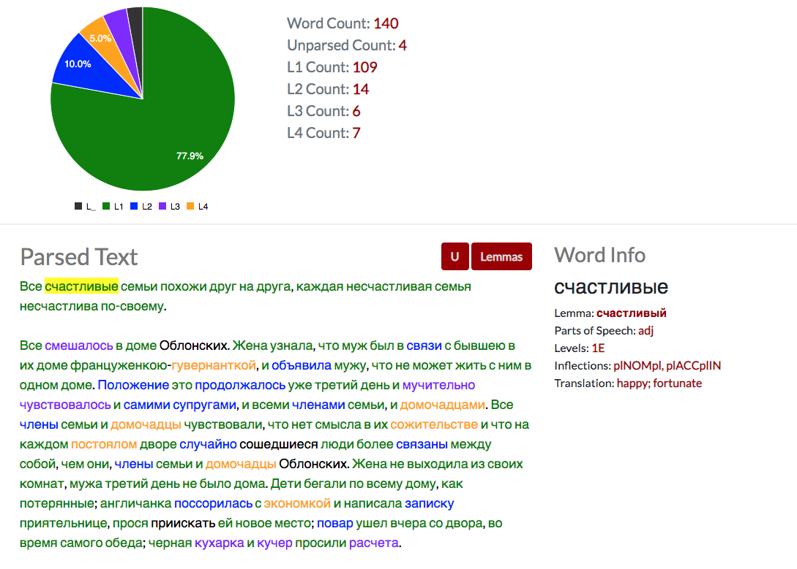

[](https://travis-ci.org/Harvard-ATG/visualizing_russian_tools)


# Visualizing Russian Tools

Visualizing Russian is a suite of web-based tools for language learners, researchers, and teachers. 



## Getting Started

```
pip install -r requirements.txt
./manage.py migrate
./manage.py import_clancy_sqldump
./manage.py runserver
```

Using docker:

```
docker build . -t visualizing_russian_tools
docker run -p 8000:8000 visualizing_russian_tools
```

Or with docker-compose:

```
docker-compose up
```

## Spreadsheet Import

Given that the lemma and word form data for this project is sourced from Steven Clancy's spreadsheet, the following tools can be used to extract the data from spreadsheet and populate a database. The conversion process produces a SQLite database, which can either be used directly by django, or dumped into a SQL file that can then be loaded into another database.

To convert a spreadsheet and output a SQL dump:

```
$ ./manage.py convert_clancy_spreadsheet --csvfile russian.csv --dbfile russian.sqlite3
$ sqlite3 russian.sqlite3 .dump > russian.sql
```

To import a SQL dump:

```
$ ./manage.py import_clancy_sqldump --sqlfile russian.sql
```

## Running unit tests

Python/Django:

```
$ ./manage.py test
```

Javascript:

```
$ open ./parser_tool/static/js/tests/SpecRunner.html
```

To update the coverage badge:

```
$ coverage run --source='.' manage.py test
$ coverage-badge -f -o coverage.svg
```
